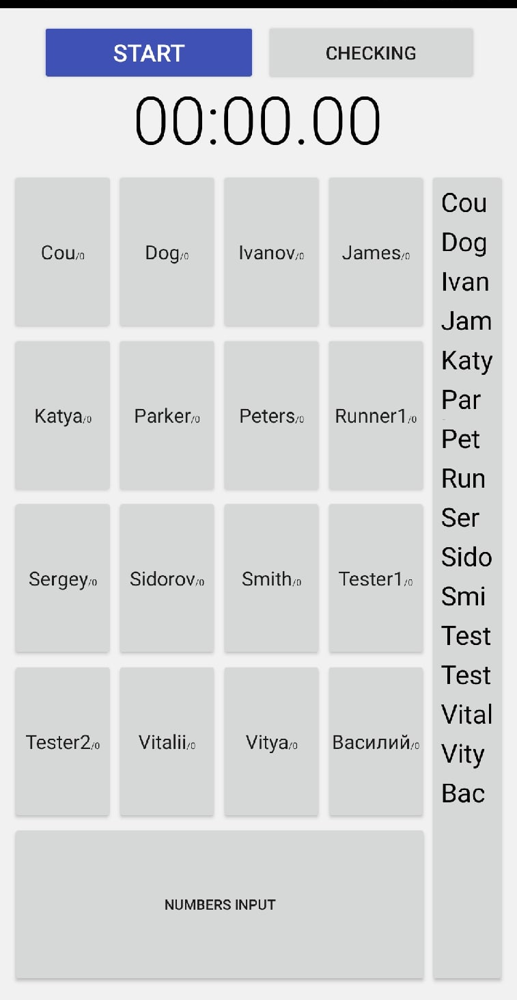
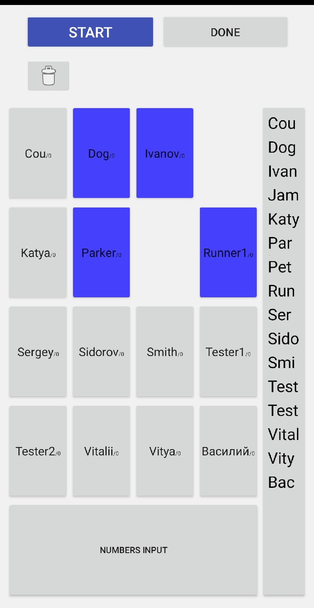
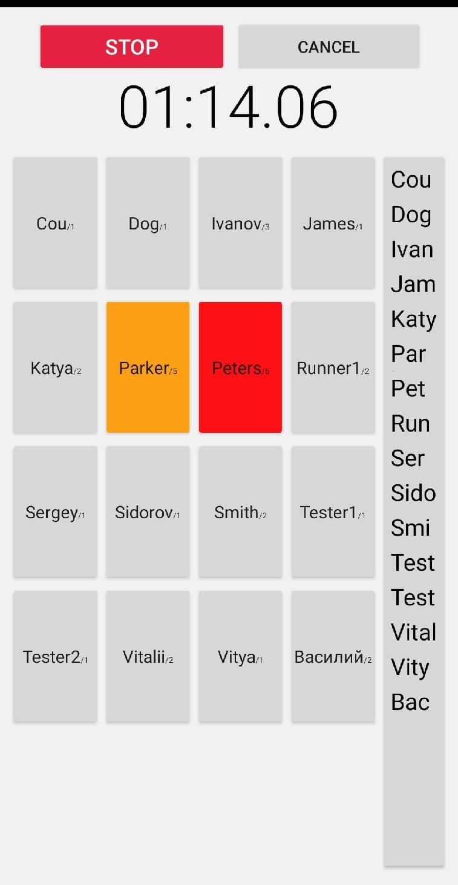
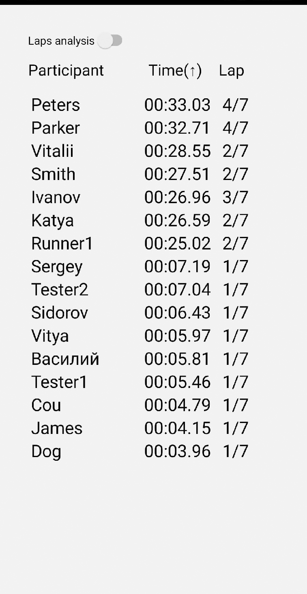
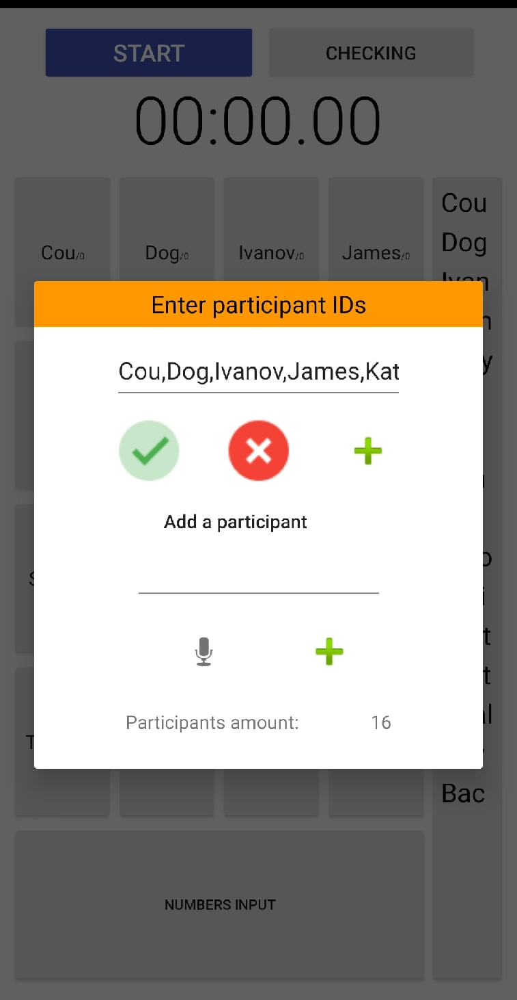
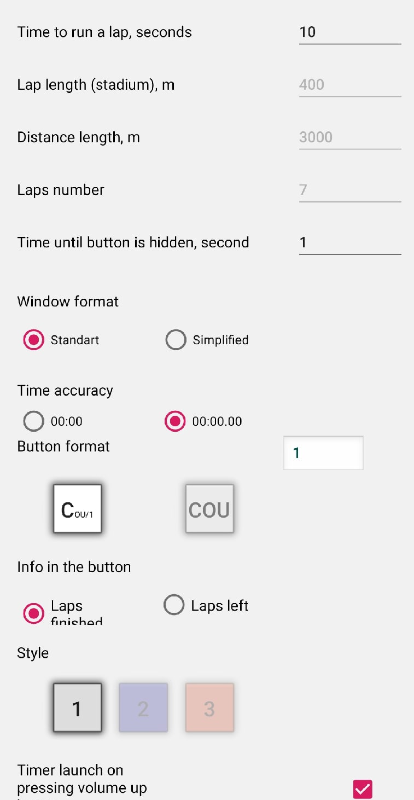
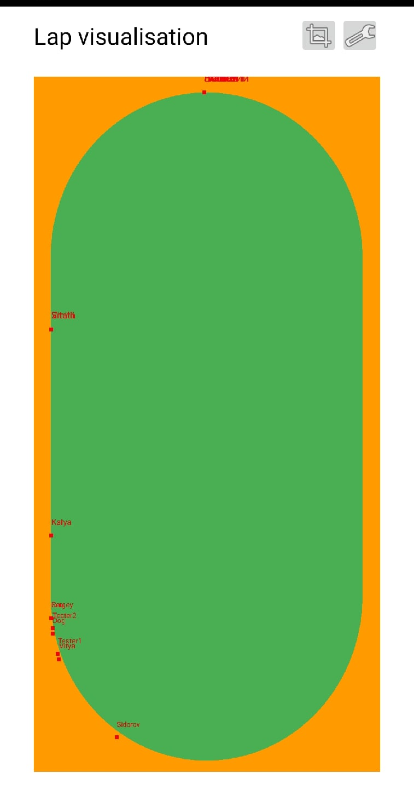
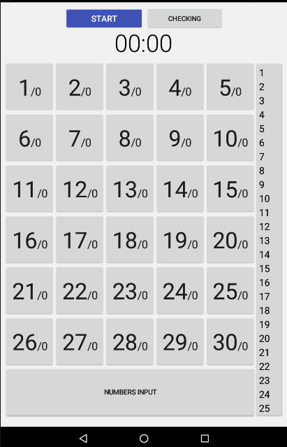

# Sportwatch
Fig. 1 - main window
 

 
Fig. 2 - checking button state
 

 
Fig. 3 - working stopwatch
 

 
Fig. 4 - result table
 

 
Fig. 5 - adding runners by voice
 

 
Fig. 6 - settings tab
 

 
Fig. 7 - visualisation tab
 

 
Fig. 8 - 7 inch devices
 

